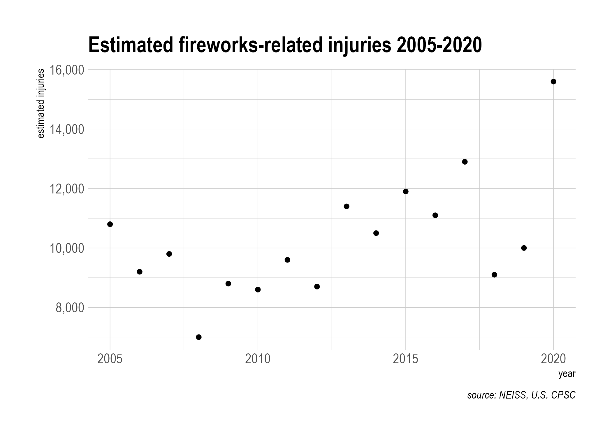

<!-- README.md is generated from README.Rmd. Please edit that file -->

# 🎆 fireworking

Playing around with data from U.S. Consumer Products Safety Commission
(CPSC) [2020 Fireworks Annual
Report](https://www.cpsc.gov/s3fs-public/2020-Fireworks-Annual-Report.pdf).[1]

``` r
library(tidyverse)
library(tabulizer)
library(pdftools)
# plus some bonus appearances from other packages,
# e.g. {janitor}, {hrbrthemes}, and {scales}
```

The report is available online as a pdf, so let’s tell R about that.

``` r
pdf_file <- "https://www.cpsc.gov/s3fs-public/2020-Fireworks-Annual-Report.pdf"
```

Now we’ll extract the table on p.14 of the report using
[{tabulizer}](https://github.com/ropensci/tabulizer), and do a little
cleaning up with an assist from
[{janitor}](https://sfirke.github.io/janitor/index.html).

``` r
p14_tables <- extract_tables(pdf_file, pages = 14, output = "data.frame")

# returns a list, so take first item from list
injuries_by_year <- p14_tables[[1]]

injuries_by_year <- injuries_by_year %>%
  as_tibble() %>%
  janitor::clean_names() %>%
  mutate(estimated_injuries = as.numeric(str_remove(estimated_injuries, ","))) %>%
  rename("injuries_per_100000" = "injuries_per_100_000_people")

injuries_by_year
#> # A tibble: 16 x 3
#>     year estimated_injuries injuries_per_100000
#>    <int>              <dbl>               <dbl>
#>  1  2020              15600                 4.7
#>  2  2019              10000                 3  
#>  3  2018               9100                 2.8
#>  4  2017              12900                 4  
#>  5  2016              11100                 3.4
#>  6  2015              11900                 3.7
#>  7  2014              10500                 3.3
#>  8  2013              11400                 3.6
#>  9  2012               8700                 2.8
#> 10  2011               9600                 3.1
#> 11  2010               8600                 2.8
#> 12  2009               8800                 2.9
#> 13  2008               7000                 2.3
#> 14  2007               9800                 3.3
#> 15  2006               9200                 3.1
#> 16  2005              10800                 3.7
```

Now let’s plot it to see the general trend visually.

``` r
ggplot(injuries_by_year, aes(x = year, y = estimated_injuries)) +
  geom_point() +
  scale_y_continuous(label = scales::label_comma()) +
  labs(title = "Estimated fireworks-related injuries 2005-2020",
       caption = "source: NEISS, U.S. CPSC",
       alt = paste("A scatterplot showing an increasing trend in",
                   "estimated-injuries from 2008 to 2020")) +
  ylab("estimated injuries") +
  hrbrthemes::theme_ipsum()
```



Looks like 2020 was a big year for getting injured with fireworks (which
is probably a surprise to no one).

------------------------------------------------------------------------

[1] Marier, A., Smith, B., Lee, S. (2021, June). *2020 Fireworks Annual
Report: Fireworks-related deaths, emergency depertment-treated injuries,
and enforcement activities during 2020*. U.S. Consumer Product Safety
Commission.
<https://www.cpsc.gov/s3fs-public/2020-Fireworks-Annual-Report.pdf>
